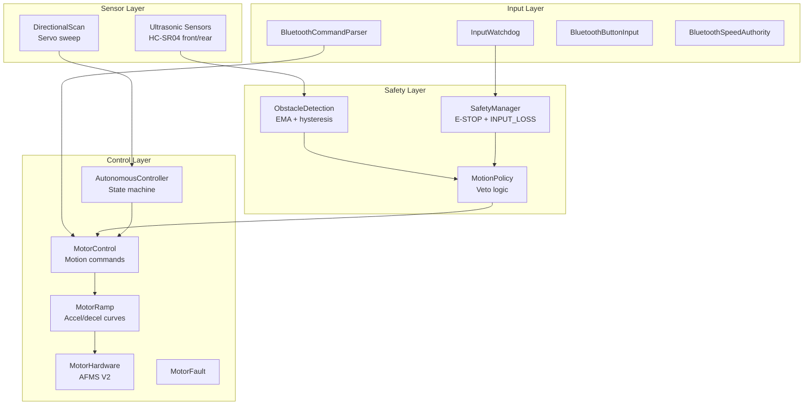
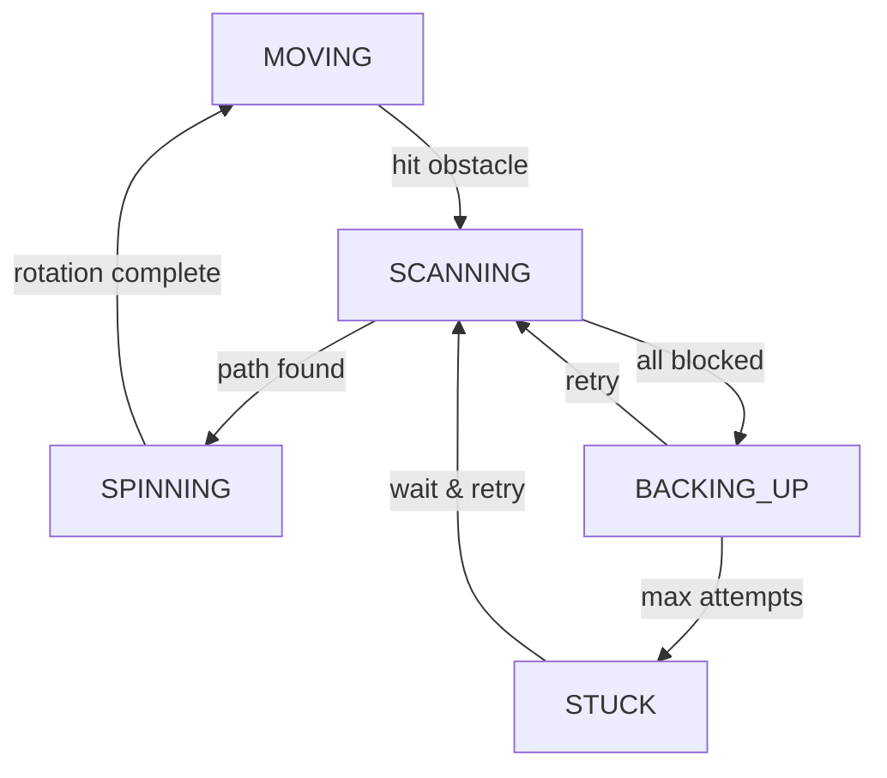

# Project MecanumCar Architecture

## Overview

Bluetooth-controlled Mecanum wheel robot with autonomous obstacle avoidance. Arduino Uno + Adafruit Motor Shield V2 (TB6612FNG motor driver + PCA9685 PWM controller), modular C++ firmware on the Arduino Framework, dual HC-SR04 ultrasonic sensors with servo turret, real-time safety subsystem with independent front/rear obstacle detection.

---

## Firmware Architecture

### Module Organization

**Comms** (`src/comms/`)
- `Comms` — Serial output multiplexing (debug mirror + Bluetooth feedback)
- `MultiPrint` — Fans output to two channels simultaneously
- Handles message formatting and transmission

**Control** (`src/control/`)
- `MotorHardware` — Singleton hardware ownership of motors; raw PWM interface to AFMS V2
- `MotorControl` — Applies motion commands to motors via MotorHardware
- `MotorRamp` — Acceleration/deceleration curves (400ms accel, 200ms decel)
- `MotorFault` — Fault state tracking and latching
- `ModeManager` — Manual vs. Autonomous mode switching with state tracking
- `AutonomousController` — Autonomous state machine (MOVING → SCANNING → SPINNING → BACKING_UP → STUCK) with servo sweep and pathfinding
- `MotionCommand` — Data structure for motion intents (speed, direction)

**Input** (`src/input/`)
- `BluetoothCommandParser` — Parses ASCII commands from HC-06 serial
- `BluetoothButtonInput` — Maps button commands (W/A/S/D/Q/E/Z/C/J/L/X) to motion intents
- `BluetoothSpeedAuthority` — Handles speed step control (%+, %-, %R/%N/%F)
- `BluetoothSystemCommands` — Handles system commands (!, ?, 0, 1)
- `InputWatchdog` — Bluetooth keepalive; auto-stop on signal loss (150ms timeout)

**Safety** (`src/safety/`)
- `ObstacleDetection` — Sensor thresholds with EMA filtering (alpha=0.35) and hysteresis
  - Front: SLOW (40-50cm), STOP (15-25cm)
  - Rear: SLOW (40-50cm), STOP (15-25cm)
  - Returns `Proximity` struct: `in_slow_zone`, `in_stop_zone`, `distance_cm`
- `SafetyManager` — System fault aggregation (emergency stop, input loss)
- `MotionPolicy` — Decision logic for motion vetoes
  - Applies emergency stop override
  - Applies input loss (watchdog timeout) override
  - Applies obstacle detection scaling (0.5× in slow zone, block in stop zone)
  - Independent front/rear logic — can reverse when front blocked

**Sensors** (`src/sensors/`)
- `Sensors` — HC-SR04 wrapper with EMA-filtered readings
  - `get_front_distance_cm()` — EMA-filtered front sensor
  - `get_rear_distance_cm()` — EMA-filtered rear sensor
  - `get_front_distance_raw_cm()` — Raw single ping (used during servo sweeps)
  - `get_rear_distance_raw_cm()` — Raw single ping
  - Dropout handling: `dist==0` treated as 999cm (assume clear)
- `DirectionalScan` — Servo sweep logic and multi-angle distance measurement
  - Sweeps 5 positions: LEFT (180°), FRONT_LEFT (135°), CENTER (90°), FRONT_RIGHT (45°), RIGHT (0°)
  - Returns `SweepResult` with distances and `clear_mask` (bitmask of clear directions)
  - Settle time: 500ms per position (configurable `SCAN_SERVO_SETTLE_MS`)

**Main Loop** (`src/main.cpp`)
1. `BluetoothCommandParser::handle(input_watchdog)` — Receive and dispatch commands
2. `input_watchdog.update()` — Check for signal loss (150ms timeout)
3. `ObstacleDetection::update()` — Poll sensors, apply hysteresis, update front/rear flags
4. `SafetyManager::update()` — Aggregate all fault states (E-STOP, INPUT_LOSS, obstacle flags)
5. `AutonomousController::update(input_watchdog)` — Execute autonomous state machine if in AUTO mode
6. `MotorRamp::update()` — Apply ramping curves (400ms up, 200ms down)
7. `MotorControl::update()` — Write final PWM values to motor shield

### Flowchart



---

## Autonomous State Machine

### States (AutonomousController)

**MOVING**
- Drive forward at `AUTO_SPEED` (600 per-mille = 60%)
- Continuously monitor front/rear obstacles via `ObstacleDetection::get_front()` / `get_rear()`
- Transition to SCANNING on obstacle detection

**SCANNING**
- Stop at obstacle (front distance < `FRONT_STOP_ENTER_CM`)
- Servo sweeps 5 positions via `DirectionalScan::start_sweep()`
- Measure distance at each position (raw readings, bypasses EMA)
- Evaluate `SweepResult::clear_mask` (bitmask of clear directions)
- Transition to SPINNING, rotating toward clearest direction

**SPINNING**
- Rotate toward clearest direction
- Duration: `AUTO_SPIN_DIAGONAL_MS` (500ms, 45° adjustments) or `AUTO_SPIN_SIDE_MS` (1000ms, 90° adjustments)
- Time-based rotation (not feedback-driven, due to sensor unreliability mid-rotation)
- Transition to MOVING after rotation complete

**BACKING_UP**
- Escape maneuver: reverse at reduced speed
- Used when all directions blocked (CORNERED logic)
- Reverse escape (max 1 second or until rear is blocked)
- Transition back to SCANNING after escape

**STUCK**
- All directions blocked (distance <threshold in all 5 positions)
- Wait `AUTO_RETRY_WAIT_MS` (2000ms)
- Retry by transitioning back to MOVING
- If retries exhausted, give up and wait for user intervention

### Navigation Logic Flow

1. MOVING: forward motion, continuous monitoring
2. Obstacle detected → SCANNING: servo sweep
3. Evaluate clear_mask from sweep results
4. Pick direction with max distance → SPINNING: rotate to that direction
5. Resume MOVING after rotation
6. If all zones blocked → BACKING_UP: escape attempt
7. BACKING_UP → SCANNING: retry
8. If too many retries → STUCK: wait and retry



---

## Control Protocol

### Command Format (ASCII, no framing)

Single-character commands sent one at a time or batched.

**Movement** (no prefix)
- `W` — Forward
- `S` — Backward
- `A` — Strafe left
- `D` — Strafe right
- `Q` — Forward-left diagonal
- `E` — Forward-right diagonal
- `Z` — Backward-left diagonal
- `C` — Backward-right diagonal
- `J` — Spin left (CCW)
- `L` — Spin right (CW)
- `X` — Soft stop (non-latching, also used as idle heartbeat)

**Speed Control** (`%` prefix)
- `%+` — Increase speed (apply `SPEED_STEP_NORMAL`)
- `%-` — Decrease speed (apply `SPEED_STEP_NORMAL`)
- `%R` — Set rough step mode (10% increments)
- `%N` — Set normal step mode (5% increments)
- `%F` — Set fine step mode (1% increments)

**Joystick Input** (`@` prefix, optional)
- `@1X<val>Y<val>;` — Joystick 1 (X = strafe, Y = forward/backward)
- `@2X<val>Y<val>;` — Joystick 2 (X = rotation, Y = reserved)
- Values: signed integers in range [-127, +127]

**System** (single char)
- `!` — Emergency stop (latching fault)
- `?` — Reset / clear emergency stop
- `1` — Autonomous mode ON
- `0` — Autonomous mode OFF

### Feedback (Robot → App)

- `*G[value]*` — Speed gauge; value is 0–1000 (PWM 0–4095 scaled)
- `*%[mode]*` — Step mode; `Fine`, `Normal`, or `Rough`

### Watchdog Behavior

- 150ms timeout on no valid command
- Idle `X` resets timeout without stopping motors (emergent heartbeat)
- Any valid command resets timeout
- Timeout → SafetyManager asserts INPUT_LOSS → MotorPolicy blocks all motion

---

## Safety Subsystem

**Note:** Obstacle avoidance is **disabled by default** (`ENABLE_OBSTACLE_AVOIDANCE = 0` in Config.h). Enable it manually if desired.

### Watchdog

- **Timeout:** 150ms (`INPUT_WATCHDOG_TIMEOUT_MS`)
- **Trigger:** No valid command received within timeout
- **Action:** InputWatchdog notifies SafetyManager, which asserts INPUT_LOSS flag
- **Result:** MotorPolicy blocks all motion until `?` (reset) command
- **Emergent design:** Idle `X` command resets timeout without requiring dedicated keepalive frame

### Obstacle Detection

**Thresholds** (configurable in Config.h)

| Zone | Distance | Action |
|------|----------|--------|
| Clear | >50cm | Full speed, no veto |
| Slow | 40–50cm | Scale to 0.5× speed (`OA_SOFT_AUTHORITY`) |
| Stop | 15–25cm | Block forward motion, force backoff if in motion |
| Blocked | <15cm | Don't enter this state |

**Hysteresis** (prevents oscillation at thresholds)
- Slow zone: 40cm entry → 50cm exit
- Stop zone: 15cm entry → 25cm exit

**EMA Filtering**
- Alpha = 0.35 (both front and rear)
- Balances responsiveness vs. noise suppression
- Formula: `filtered = filtered + alpha * (raw - filtered)`

**Independent Front/Rear**
- Front blocked → can't drive forward, but can reverse
- Rear blocked → can't reverse, but can drive forward
- Diagonal movement: both sensors must clear respective zones

**Sensor Dropout**
- `dist == 0` (raw sensor output) treated as 999cm (assume clear)
- Absorbs occasional sensor glitches without compensation math

### Emergency Stop

- Triggered by `!` command
- Latches until `?` (reset) command
- Overrides all motion including autonomous state machine
- SafetyManager tracks state; MotorPolicy enforces block

---

## Refactor History

### What Changed (Architecture Refactor 2026)

**Deleted (Old Architecture)**
- `include/control/Veto.h` / `src/control/Veto.cpp`
- `include/control/MotorPolicy.h` / `src/control/MotorPolicy.cpp`
- `include/control/AutonomousOA.h` / `src/control/AutonomousOA.cpp`

**Created (New Architecture)**
- `include/safety/ObstacleDetection.h` / `src/safety/ObstacleDetection.cpp`
- `include/safety/SafetyManager.h` / `src/safety/SafetyManager.cpp`
- `include/safety/MotionPolicy.h` / `src/safety/MotionPolicy.cpp`
- `include/control/AutonomousController.h` / `src/control/AutonomousController.cpp`

### The Bug That Was Fixed

**Problem:** Car wouldn't move when obstacle was at 45cm (soft block range)

**Root Cause:** Double-veto in `MotorPolicy::apply_directional_veto()`

```cpp
// OLD CODE (BROKEN)
if (Veto::has_reason(VetoReason::OA_FRONT)) {
    cmd.forward = 0.0f;  // ❌ Kills motion at 40cm
}
// Then authority scaling applies:
cmd.forward *= 0.5f;  // 0.0 * 0.5 = still 0.0
```

**Solution:** Separate stop zones from slow zones
- **Slow zone (40-50cm):** Only scale authority by 0.5x
- **Stop zone (15-25cm):** Force backoff or block motion

### New Architecture Benefits

1. **Clear Separation of Concerns** – Each safety module has one job
2. **Single Truth Source** – Policy owns "can we move" decision
3. **Better Hysteresis** – Per-sensor timers, independent front/rear
4. **Smarter Autonomous** – Added CORNERED and STUCK states
5. **Simpler Integration** – InputWatchdog just reports state; MotorControl has one safety call

---

## Safety Quick Reference

### Module Purposes (One-Line Each)

- **ObstacleDetection** — Reads sensors, applies thresholds with hysteresis, returns Proximity structs
- **SafetyManager** — Tracks emergency stop and input loss faults
- **MotionPolicy** — Decides what motion is allowed based on obstacles + safety state
- **AutonomousController** — State machine for autonomous driving with escape logic

### Key API Usage

**Check Obstacles**
```cpp
#include "safety/ObstacleDetection.h"

Proximity front = ObstacleDetection::get_front();
if (front.in_stop_zone) {
    // Too close! (within 15-25cm)
}
if (front.in_slow_zone) {
    // Approaching (within 40-50cm)
}
uint16_t distance = front.distance_cm;  // raw reading
```

**Check Safety State**
```cpp
#include "safety/SafetyManager.h"

SafetyState state = SafetyManager::get_state();
// Returns: CLEAR, INPUT_LOSS, or EMERGENCY_STOP
```

**Apply Motion Safely**
```cpp
#include "safety/MotionPolicy.h"

MotionCommand cmd = { 1.0f, 0.0f, 0.0f };  // forward
MotionCommand safe = MotionPolicy::apply_safety(cmd);
// safe.forward might be:
// - 0.0 (emergency stop / input loss)
// - 0.5 (slow zone scaling)
// - -0.25 (backoff from stop zone)
// - 1.0 (clear path)
```

### Data Flow

```
Sensors::get_front_distance_cm()
    ↓
ObstacleDetection::update()  [applies hysteresis]
    ↓
ObstacleDetection::get_front()  → Proximity struct
    ↓
MotionPolicy::apply_safety(cmd)  [reads obstacles + safety]
    ↓
MotorControl::apply_command(safe_cmd)
    ↓
Motors
```

### State Transitions (Autonomous)

```
MOVING ──[hit obstacle]──> SCANNING
   ↑                           ↓
   │                    [path found]
   │                           ↓
   └────[clear ahead]──── SPINNING
                               ↓
                        [all blocked]
                               ↓
                           BACKING_UP ──[max attempts]──> STUCK
                               ↑                              ↓
                               └──────[retry]────────────────┘
```

### Debug Output

Enable in `Config.h`:
```cpp
#define DEBUG_SENSORS       1  // Prints "Front: 45 | Rear: 120"
#define DEBUG_OA_REASON     1  // Prints zone flags per sensor
#define DEBUG_OA_SCALE      1  // Prints policy decisions
#define DEBUG_WATCHDOG      1  // Prints watchdog resets
```

### Migration from Old Code

| Old (Veto) | New (Safety Modules) |
|------------|----------------------|
| `Veto::get_state()` | `SafetyManager::get_state()` + `ObstacleDetection::get_front()` |
| `Veto::is_faulted()` | `SafetyManager::get_state() == SAFETY_EMERGENCY_STOP` |
| `Veto::is_input_loss()` | `SafetyManager::get_state() == SAFETY_INPUT_LOSS` |
| `Veto::is_front_stop_active()` | `ObstacleDetection::get_front().in_stop_zone` |
| `MotorPolicy::intent_scale()` | Built into `MotionPolicy::apply_safety()` |
| `MotorPolicy::apply_directional_veto()` | Built into `MotionPolicy::apply_safety()` |

---

## Configuration

**Single config file:** `include/config/Config.h`

### Hardware Pins
- **Servo:** D10 (`SCAN_SERVO_PIN`)
- **Front Ultrasonic:** TRIG D8, ECHO D9
- **Rear Ultrasonic:** TRIG D6, ECHO D7
- **Bluetooth:** RX D11, TX D12 (SoftwareSerial)

### Servo Angles (degrees)
- `SERVO_LEFT = 180`
- `SERVO_FRONT_LEFT = 135`
- `SERVO_CENTER = 90`
- `SERVO_FRONT_RIGHT = 45`
- `SERVO_RIGHT = 0`

### Obstacle Thresholds (cm)
- **Front Slow:** 40–50cm
- **Front Stop:** 15–25cm
- **Rear Slow:** 40–50cm
- **Rear Stop:** 15–25cm

### EMA Filter
- `ULTRASONIC_EMA_ALPHA_FRONT = 0.35`
- `ULTRASONIC_EMA_ALPHA_REAR = 0.35`

### Feature Flags
- `ENABLE_INPUT_WATCHDOG = 1` (ON)
- `ENABLE_OBSTACLE_AVOIDANCE = 0` (OFF by default)
- `ENABLE_INPUT_BUTTONS = 1` (ON)
- `ENABLE_INPUT_JOYSTICK = 0` (OFF)
- `ENABLE_INPUT_SPEED_AUTHORITY = 1` (ON)

### Watchdog & Input
- `INPUT_WATCHDOG_TIMEOUT_MS = 150`
- `JOYSTICK_DEADZONE = 30.0`
- `JOYSTICK_INPUT_MAX = 127.0`

### Servo & Scan
- `SCAN_SERVO_SETTLE_MS = 500` (per position)

### Obstacle Avoidance
- `OA_CLEAR_HOLD_MS = 200` (hysteresis hold time)
- `OA_SOFT_AUTHORITY = 0.5` (speed scale in slow zone)
- `OA_BACKOFF_SPEED = 0.25` (nudge-away backoff speed)

### Autonomous Mode
- `AUTO_SPEED = 600` (per-mille, 60%)
- `AUTO_RETRY_WAIT_MS = 2000` (wait before retrying when cornered)
- `AUTO_SPIN_DIAGONAL_MS = 500` (45° rotation time)
- `AUTO_SPIN_SIDE_MS = 1000` (90° rotation time)

### Drive Behavior
- **Speed:** MIN (200), MAX (1000), DEFAULT (1000) per-mille
- **Speed steps:** ROUGH (100 = 10%), NORMAL (50 = 5%), FINE (10 = 1%)
- **Motor ramp:** UP (400ms), DOWN (200ms)
- **Turn ratio:** 1/2 (half speed on one side for turns) — constant defined but not currently used in motion mix

### Motor Output
- `PWM_MAX = 4095` (AFMS V2, 12-bit)
- (Commented: PWM_MAX = 255 for AFMS V1, 8-bit)

---

## Design Patterns

### Non-Blocking Architecture
- No `delay()` anywhere in codebase
- All timing based on `millis()`
- Sensor reads polled on demand
- Commands processed asynchronously

### Hardware Ownership
- `MotorHardware` owns Motor Shield (singleton)
- `DirectionalScan` owns servo
- `Sensors` owns HC-SR04 instances
- Other modules get refs/pointers only, never own hardware

### Threshold Tuning Over Compensation
- Sensor inaccuracy (±2–4cm) handled by hysteresis zones + EMA filtering, not math
- Simpler, more robust across environments
- Scales without calibration

### Emergent Watchdog
- No dedicated keepalive frame needed
- Idle `X` command naturally resets timeout
- Reduces protocol overhead

### Code Layout Standard
Enforced via `docs/Code_Layout_Standard.md`:
- `.h` files: `#pragma once`, INCLUDES, TYPES, API namespace (public only)
- `.cpp` files: header, INCLUDES, INTERNAL STATE, INTERNAL HELPERS, PUBLIC API
- One module per file
- Namespaces always
- No `using namespace` in headers
- Full qualification for cross-module calls

---

## Performance

| Metric | Value |
|--------|-------|
| Command latency | <10ms |
| Motor response | <50ms |
| Ultrasonic sampling | ~50ms per sensor |
| Servo sweep | ~2.5 seconds (5 positions × 500ms settle) |
| Speed ramp | 400ms accel, 200ms decel |
| Watchdog timeout | 150ms |
| Max speed | ~1.5 m/s (depends on gearing and PWM_MAX scaling) |
| PWM resolution | 12-bit (0–4095, AFMS V2) |

---

## Current Status

- Core firmware complete and tested
- Autonomous state machine validated on test runs
- Bluetooth control stable with HC-06
- Obstacle avoidance tuned for typical indoor environments (currently disabled by default)
- Ready for deployment or further customization

## Known Limitations

- Arduino Uno has limited RAM (2KB) — keep code modular
- HC-SR04 is slow (~50ms per reading) — not real-time capable
- Servo sweep blocks briefly (~2.5s) during autonomous scan
- 150ms watchdog timeout is hardcoded; may need adjustment for other Bluetooth modules
- Time-based spin (not feedback-driven) due to sensor unreliability during rotation
- Turn ratio constants are defined but not active in the motion mix