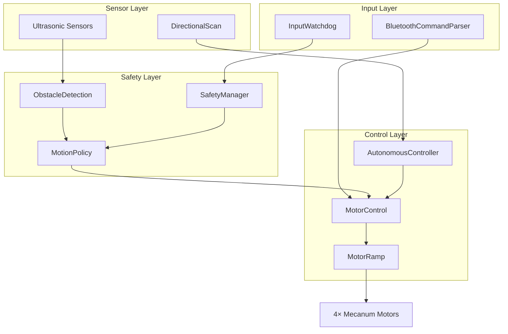

# Project MecanumCar

Bluetooth-controlled Mecanum wheel robot with autonomous obstacle avoidance. Arduino Uno + Motor Shield V2, modular C++ firmware on the Arduino Framework, dual HC-SR04 ultrasonic sensors with servo turret, real-time safety subsystem. Manual driving via Bluetooth app or autonomous mode with pathfinding. Complete rewrite of a commercial kit.

## Hardware

- **MCU**: Arduino Uno (ATmega328P)
- **Motor Driver**: Adafruit Motor Shield V2 (TB6612FNG + PCA9685, 12-bit PWM)
- **Wheels**: 4× mecanum (45° rubber rollers)
- **Sensors**: HC-SR04 front (servo-mounted, 5-position sweep) + HC-SR04 rear (static)
- **Servo**: Micro servo (SG90 or compatible) for turret scanning
- **Bluetooth**: HC-06 (9600 baud)
- **Power**: 2× 18650 lithium cells in series
- **Chassis**: Clear acrylic frame

### Pin Configuration

| Component | Pins |
|-----------|------|
| Front Ultrasonic TRIG/ECHO | D8 / D9 |
| Rear Ultrasonic TRIG/ECHO | D6 / D7 |
| Servo | D10 |
| Bluetooth RX/TX | D11 / D12 (SoftwareSerial) |

### Motor Mapping (AFMS V2)

| Wheel | Motor Port |
|-------|------------|
| Front Left | M1 |
| Front Right | M4 |
| Rear Left | M2 |
| Rear Right | M3 |

## Quick Start

### 1. Flash

```bash
pio run -t upload
pio device monitor -b 9600
```

### 2. Pair Bluetooth

- Phone Bluetooth settings → HC-06 (PIN usually 1234 or 0000)
- Android: Install [Bluetooth Electronics](https://www.keuwl.com/apps/bluetoothelectronics/)
- Load custom panel from `archive/Bluetooth Electronics Panels/`

### 3. Drive

- **Manual Mode (0)**: Use d-pad to move, speed slider to control
- **Autonomous Mode (1)**: Robot navigates obstacles automatically

## Configuration

**All settings in `include/config/Config.h`:**

### Hardware Configuration
- **Servo angles** — `SERVO_LEFT`, `SERVO_CENTER`, `SERVO_RIGHT`, etc. (degrees 0–180)
- **Ultrasonic thresholds** — `FRONT_SLOW_ENTER_CM`, `FRONT_STOP_ENTER_CM`, etc.
- **EMA filtering** — `ULTRASONIC_EMA_ALPHA_FRONT`, `ULTRASONIC_EMA_ALPHA_REAR` (0.3–0.5 recommended)

### Features
- `ENABLE_INPUT_WATCHDOG` — Bluetooth keepalive (150ms timeout, default: ON)
- `ENABLE_OBSTACLE_AVOIDANCE` — Front/rear veto logic (default: **OFF** — enable manually if desired)
- `ENABLE_INPUT_BUTTONS` — Button-based control (default: ON)
- `ENABLE_INPUT_JOYSTICK` — Joystick analog input (default: OFF)
- `ENABLE_INPUT_SPEED_AUTHORITY` — Speed slider control (default: ON)

### Drive Behavior
- **Speed** — `SPEED_USER_MIN` (200 per-mille), `SPEED_USER_MAX` (1000), `SPEED_USER_DEFAULT` (1000)
- **Speed steps** — `SPEED_STEP_ROUGH` (10%), `SPEED_STEP_NORMAL` (5%), `SPEED_STEP_FINE` (1%)
- **Motor ramp** — `RAMP_UP_TIME_MS` (400ms), `RAMP_DOWN_TIME_MS` (200ms)
- **Autonomous speed** — `AUTO_SPEED` (600 per-mille, capped during scanning)
- **Turn ratio** — `TURN_RATIO_NUM` / `TURN_RATIO_DEN` (1/2 default)

### Obstacle Avoidance
- **Slow zone** — 40–50cm → 0.5× speed
- **Stop zone** — 15–25cm → block forward or force backoff
- **Hold time** — `OA_CLEAR_HOLD_MS` (200ms hysteresis)
- **Backoff speed** — `OA_BACKOFF_SPEED` (0.25f per-unit)

### Autonomous Mode
- **Retry wait** — `AUTO_RETRY_WAIT_MS` (2000ms when cornered)
- **Spin time** — `AUTO_SPIN_DIAGONAL_MS` (500ms 45°), `AUTO_SPIN_SIDE_MS` (1000ms 90°)
- **Servo settle** — `SCAN_SERVO_SETTLE_MS` (500ms per position)

## Controls

### Movement (Manual)
- `W/S` — Forward / Backward
- `A/D` — Strafe left / right
- `Q/E/Z/C` — Diagonals (FL, FR, BL, BR)
- `J/L` — Rotate CCW / CW
- `X` — Stop / Heartbeat

### Speed
- `%+` / `%-` — Increase / Decrease (step mode)
- `%R` — Rough (10% steps)
- `%N` — Normal (5% steps)
- `%F` — Fine (1% steps)

### Joystick Input (optional)
- `@1X<val>Y<val>;` — Joystick 1 (strafe + forward/backward)
- `@2X<val>Y<val>;` — Joystick 2 (rotation)

### System
- `!` — Emergency stop (latches)
- `?` — Reset / clear E-stop
- `0` — Manual mode
- `1` — Autonomous mode

See `docs/Control_Protocol.md` for full protocol details and `docs/Code_Layout_Standard.md` for architecture standards.

## Safety Features

- **Watchdog**: 150ms Bluetooth timeout → auto-stop
- **Obstacle Detection**: Front/rear independent
  - Clear (>50cm): Full speed
  - Slow (40–50cm): 0.5× speed with hysteresis
  - Stop (<25cm): Block or backoff
- **Sensor Dropout**: `dist==0` treated as clear (sensor glitch absorption)
- **Independent Vetoes**: Front blocked ≠ rear blocked (can reverse when front is blocked)

## Autonomous Mode

1. Drives forward at `AUTO_SPEED` (600 per-mille = 60%)
2. On obstacle: stops, servo sweeps 5 positions (left, FL, center, FR, right)
3. Picks clearest path, rotates toward it
4. Resumes driving
5. If cornered: waits `AUTO_RETRY_WAIT_MS` (2 seconds), retries

**Note:** Enable via `ENABLE_OBSTACLE_AVOIDANCE = 1` in Config.h; disabled by default.

## Architecture & Code

**Modules** (`src/`, namespaced C++):
- `comms/` — Bluetooth parser, serial output multiplexing
- `control/` — Motor control, ramping (400ms accel/200ms decel), autonomous state machine
- `input/` — Bluetooth watchdog, button/joystick parsing, speed authority
- `safety/` — Obstacle detection with EMA filtering, motion policy
- `sensors/` — HC-SR04 wrapper, distance caching, directional servo scan



**Code Layout**: Enforced via `docs/Code_Layout_Standard.md`
- `.h` files: public API only, no implementation
- `.cpp` files: internal state, callbacks, logic, public API
- One module per file, namespaces always
- Hardware ownership rule: one module owns each resource

**Design Patterns**:
- Non-blocking architecture (no `delay()`)
- Threshold tuning over math compensation
- Emergent watchdog (idle `X` resets timeout)
- EMA filtering for sensor noise suppression

## Troubleshooting

**Robot won't move**
- Check E-stop: send `?` to reset
- Verify Bluetooth connected (check serial output)
- Check battery voltage (should be >6V for two 18650s)
- Test individual motors manually

**Bluetooth keeps disconnecting**
- Move closer to phone (HC-06 range ~10m)
- Reduce electromagnetic interference
- Try re-pairing

**Obstacle avoidance not working**
- Check sensor wires (HC-SR04 needs GND, 5V, TRIG, ECHO)
- Watch serial output: `[SENS] Front: XX cm`
- Adjust thresholds in `Config.h` if using different sensors
- Enable `DEBUG_OA_REASON` in `Config.h` to debug veto logic

**Servo doesn't scan**
- Check D10 connection to servo control line
- Verify servo power (should be ~6V, not from Arduino 5V pin)
- Adjust `SERVO_LEFT`, `SERVO_CENTER`, `SERVO_RIGHT` angles

## Debug Flags

Enable in `Config.h`:

```cpp
#define DEBUG_ENABLED 1
#define COMMS_DEBUG_MIRROR  1  // Echo commands to debug serial
#define DEBUG_COMMS         0  // Log Bluetooth communication
#define DEBUG_MOTOR_RAMP    0  // Print ramp calculations
#define DEBUG_OA_REASON     1  // Print veto reasons
#define DEBUG_OA_SCALE      1  // Print speed scaling
#define DEBUG_SENSORS       1  // Print sensor readings
#define DEBUG_WATCHDOG      1  // Print watchdog resets
```

Then `pio device monitor -b 9600` to see output.

## Performance

- Command latency: <10ms
- Motor response: <50ms
- Ultrasonic sampling: ~50ms per sensor
- Servo sweep: ~2.5 seconds (5 positions × 500ms settle)
- Speed ramp: 400ms accel, 200ms decel
- Watchdog timeout: 150ms
- Max speed: ~1.5 m/s (depends on gearing)

## Documentation

- `docs/Control_Protocol.md` — ASCII command protocol reference
- `docs/Code_Layout_Standard.md` — Module organization, file structure standards
- `ARCHITECTURE.md` — Full system design (modules, state machine, safety subsystem)

## For Developers

This project enforces a strict code layout standard documented in [`docs/Code_Layout_Standard.md`](docs/Code_Layout_Standard.md). Key rules:

- One logical module per file
- Headers declare public API only — no implementation
- Source files contain all implementation and internal state
- Comment hierarchy: T1 (file header) → T7 (inline notes)

When contributing, follow the visual hierarchy scale defined in the standard document.

## Credits

This project was developed with human oversight and AI-assisted code generation.